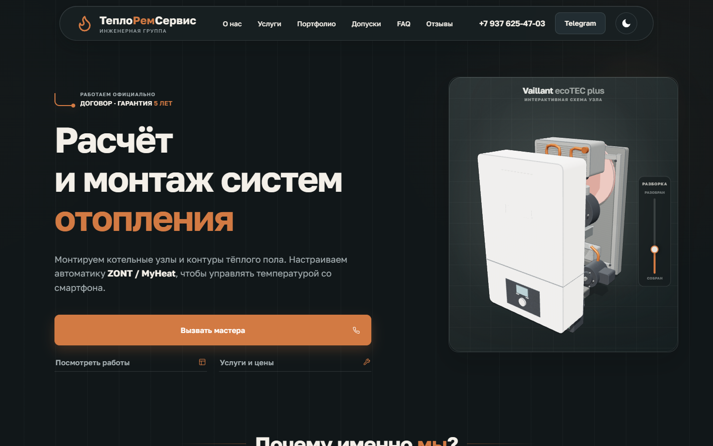
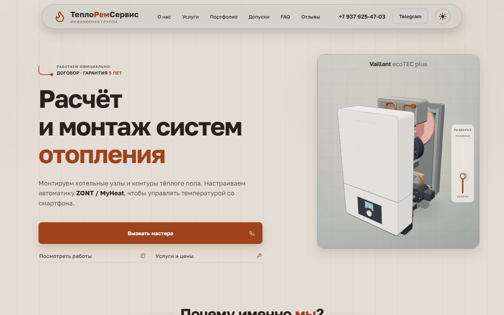
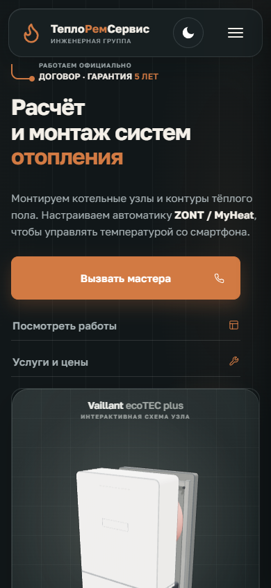
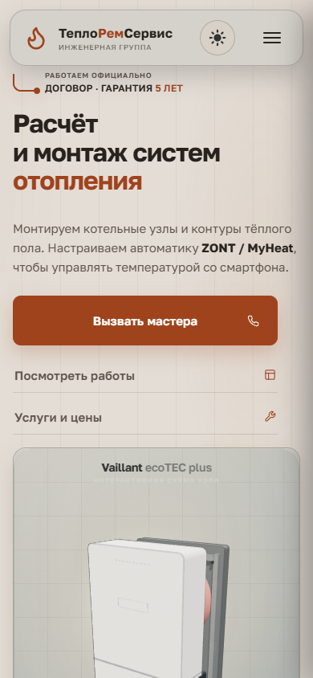

# UX/UI и визуальный аудит `index.html`

Дата аудита: 26 августа 2026 года  
Страница: `index.html`  
Темы: светлая и тёмная  
Разрешения: desktop 1440 × 900, mobile 390 × 844

Аудит выполнен по свежему рендеру текущего `index.html` в локальном Chromium. Код страницы не изменялся.

Снимки получены из того же локального файла через браузерную автоматизацию, а не непосредственно из открытой пользовательской вкладки Chrome: доступ к ней через расширение оказался недоступен.

## Скриншоты

### Desktop, 1440 × 900

Тёмная тема:

Светлая тема:

### Mobile, 390 × 844

Тёмная тема:

Светлая тема:

### Полноразмерные снимки

- [Тёмная desktop — вся страница](output/playwright/index-audit/index-dark-desktop.png)
- [Светлая desktop — вся страница](output/playwright/index-audit/index-light-desktop.png)
- [Тёмная mobile — вся страница](output/playwright/index-audit/index-dark-mobile.png)
- [Светлая mobile — вся страница](output/playwright/index-audit/index-light-mobile.png)

## Что из прежних замечаний уже не подтверждается

- Desktop-блоки в основном приведены к общей ширине: около 1220 px с отступами по 110 px.
- Светлая тема больше не использует ослепительно-белый фон: фактический основной цвет — тёплый серо-бежевый.
- На ширине 390 px горизонтального переполнения нет.
- `focus-visible`, hover и active-состояния в коде присутствуют. Проблема не в полном отсутствии состояний, а в их визуальной неоднородности.
- Дефект галереи, замеченный на одном из ранних снимков, оказался артефактом принудительного отключения анимаций и на актуальном рендере не воспроизводится.

## 1. Визуальная согласованность

### 1.1. Светлая тема теряет разделение между уровнями интерфейса

Основной фон, панели, карточки и вложенные поверхности построены на близких серо-бежевых оттенках. Блоки формально разделены рамками и тенями, но воспринимаются как одна тяжёлая масса. Особенно это заметно в секциях портфолио, стоимости, отзывов и формы.

**Почему это проблема:** пользователю сложнее мгновенно отделить секции, вложенные области и интерактивные элементы друг от друга. Иерархия сильнее зависит от текста, чем от композиции.

**Критичность:** желательно исправить.  
**Источник:** скриншот и код.  
**Темы:** только светлая.

### 1.2. Часть акцентного текста не достигает нормального контраста в светлой теме

Акцентный цвет около `rgb(159, 67, 29)` на серой панели около `rgb(208, 204, 198)` даёт приблизительно 3,99:1. При этом он используется в подписях размером 10–11 px: например, в метаданных отзывов и строке «Официальные допуски».

**Почему это проблема:** мелкие подписи становятся трудночитаемыми и не проходят ориентир 4,5:1 для обычного текста.

**Критичность:** критично.  
**Источник:** скриншот и код.  
**Темы:** только светлая.

### 1.3. Микротипографика местами слишком мелкая

В интерфейсе много подписей 10–11 px с увеличенным межбуквенным интервалом. Подзаголовок виджета котла «Интерактивная схема узла» имеет всего 8 px. На мобильном экране он почти не читается, а в светлой теме дополнительно теряется по контрасту.

**Почему это проблема:** служебная информация превращается в декоративный шум. Увеличенный трекинг не компенсирует недостаточный кегль.

**Критичность:** критично для текста 8 px; желательно исправить для остальных микроподписей.  
**Источник:** скриншот и код.  
**Темы:** обе, сильнее в светлой.

### 1.4. Заголовки секций принадлежат нескольким разным визуальным системам

На одной странице используются:

- центрированный заголовок с линиями — «Наши работы»;
- крупный левый editorial-заголовок — «Выполняем полный цикл…»;
- стандартные центрированные заголовки;
- заголовки внутри инженерных панелей;
- заголовок допуска как часть двухколоночного dossier.

**Почему это проблема:** переходы между секциями выглядят как последовательность отдельных редизайнов, а не как единая страница одной компании.

**Критичность:** желательно исправить.  
**Источник:** скриншот и код.  
**Темы:** обе.

### 1.5. Осталась небольшая неоднородность мобильной сетки

На ширине 390 px обычные секции имеют примерно 358 px и отступ 16 px, портфолио и некоторые доказательные блоки — около 366 px с отступом 12 px, виджет котла — около 356 px с отступом 17 px.

**Почему это проблема:** края блоков слегка «гуляют». На длинной странице это заметнее, чем на одном экране.

**Критичность:** мелочь.  
**Источник:** скриншот и измерение рендера.  
**Темы:** обе.

### 1.6. Мобильная группа действий уже основного контейнера

Группа CTA в hero ограничена примерно 330 px при доступной ширине контента около 358 px. Основная кнопка и две строки-ссылки поэтому не совпадают по краям с текстом и последующим виджетом.

**Почему это проблема:** первый экран выглядит менее собранным, несмотря на отсутствие технического overflow.

**Критичность:** мелочь.  
**Источник:** скриншот и код.  
**Темы:** обе.

### 1.7. Фотографии, 3D-объект и документы используют сильно разные визуальные языки

Первый экран построен вокруг чистого 3D-рендера котла, портфолио — на реальных фотографиях, блок допуска — на скане документа, а большинство иконок — тонкие линейные SVG.

**Почему это проблема:** каждый тип изображения уместен сам по себе, но в совокупности страница колеблется между рекламным 3D, инженерным интерфейсом и документальной подачей.

**Критичность:** желательно исправить.  
**Источник:** скриншот.  
**Темы:** обе.

### 1.8. В светлой теме тени создают тяжёлые серые ореолы

Тени хорошо отделяют шапку, CTA и панели, но на тёплом светлом фоне они выглядят грязнее, чем в тёмной теме. Особенно заметны шапка, форма и крупные составные панели.

**Почему это проблема:** вместо ощущения воздуха появляется визуальная тяжесть, хотя палитра сама по себе стала спокойнее.

**Критичность:** желательно исправить.  
**Источник:** скриншот.  
**Темы:** только светлая.

## 2. Компонентная согласованность

### 2.1. Главный CTA обещает звонок, но открывает форму

Кнопка называется «Вызвать мастера», содержит телефонную иконку, но ссылка ведёт на `#calc`, а не запускает звонок. Это одинаково работает на desktop и mobile.

**Почему это проблема:** текст и пиктограмма формируют ожидание прямого телефонного действия, а фактическое действие — прокрутка к форме. Несовпадение особенно существенно на телефоне.

**Критичность:** критично.  
**Источник:** скриншот и код.  
**Темы:** обе.

### 2.2. Одинаковые по смыслу переходы выглядят как разные типы элементов

Переходы к работам и услугам в hero оформлены как широкие строки с тонким разделителем. Telegram — как контурная кнопка. Переходы в портфолио и допусках — как текст с маленькой стрелкой. Ссылка на Яндекс — ещё один отдельный вариант.

**Почему это проблема:** пользователь не получает стабильного визуального шаблона для «перейти в другой раздел» и вынужден каждый раз заново распознавать интерактивность.

**Критичность:** желательно исправить.  
**Источник:** скриншот и код.  
**Темы:** обе.

### 2.3. Карточки и панели не выглядят частями одной компонентной системы

На странице одновременно присутствуют:

- отдельные trust-карточки;
- плоская двухколоночная панель портфолио;
- dossier-панель «О компании»;
- таблицеподобная сетка услуг;
- две объединённые панели стоимости;
- документальная карточка допуска;
- ledger-структура отзывов;
- самостоятельная карточка формы.

**Почему это проблема:** различия превышают необходимую семантическую вариативность. Страница воспринимается как набор самостоятельных модулей.

**Критичность:** желательно исправить.  
**Источник:** скриншот и код.  
**Темы:** обе.

### 2.4. Hover-состояния есть, но используют слишком разные эффекты

Кнопки поднимаются и меняют тень, строки сдвигают стрелку, карточки меняют фон или внутреннюю рамку, изображения масштабируются, а часть ссылок меняет только оттенок.

**Почему это проблема:** обратная связь присутствует, но не формирует единый язык поведения. На длинной странице невозможно предсказать реакцию элемента по его внешнему виду.

**Критичность:** мелочь.  
**Источник:** код.  
**Темы:** обе.

### 2.5. Некоторые элементы распознаются как интерактивные главным образом через hover

Строки проектов, документ допуска и ряд текстовых ссылок в покое отличаются от обычного контента лишь небольшой стрелкой, индексом или курсором. На touch-экране hover отсутствует.

**Почему это проблема:** на мобильном устройстве кликабельность части элементов становится менее очевидной.

**Критичность:** желательно исправить.  
**Источник:** скриншот и код.  
**Темы:** обе.

### 2.6. Focus-состояния заметны, но визуально не полностью унифицированы

Глобально используется трёхпиксельная обводка с внешним отступом. В отдельных галереях, документах и accordion применяются двухпиксельные внутренние обводки с другими отступами.

**Почему это проблема:** доступность с клавиатуры сохранена, но один и тот же статус отображается несколькими способами.

**Критичность:** мелочь.  
**Источник:** код.  
**Темы:** обе.

## 3. UX и структура

### 3.1. Мобильная страница чрезмерно длинная

Полная высота при viewport 390 px составляет около 9856 px. После hero последовательно показываются котёл, три преимущества, портфолио, компания, четыре этапа работы, стоимость, зона обслуживания, допуск, рейтинг, три полных отзыва, форма и footer.

**Почему это проблема:** возрастает когнитивная нагрузка и вероятность ухода до достижения формы или контактных данных. Повторяющиеся крупные панели усиливают ощущение длины.

**Критичность:** критично для мобильного пути конверсии.  
**Источник:** полноразмерный скриншот.  
**Темы:** обе.

### 3.2. Интерактивный котёл занимает слишком большую долю раннего мобильного пути

После текста и CTA пользователь получает крупный вертикальный 3D-виджет. Он занимает значительную часть следующих экранов, хотя не отвечает на основные вопросы о стоимости, сроках или доверии.

**Почему это проблема:** визуальная демонстрация получает больше пространства, чем ключевые аргументы выбора компании.

**Критичность:** желательно исправить.  
**Источник:** скриншот.  
**Темы:** обе.

### 3.3. В тёмной теме белый котёл перетягивает фокус с CTA

Контраст белой модели на почти чёрной поверхности очень высок. После первого взгляда на заголовок внимание быстро переходит к изображению, а не к основному действию.

**Почему это проблема:** самый сильный визуальный объект не является целевым действием.

**Критичность:** желательно исправить.  
**Источник:** скриншот.  
**Темы:** преимущественно тёмная.

### 3.4. В светлой теме тот же котёл частично сливается с панелью

Белый корпус находится на светло-серой подложке. Контуры читаются хуже, мелкие элементы схемы и подпись почти исчезают.

**Почему это проблема:** крупный и дорогой по занимаемому месту элемент теряет детализацию и воспринимается менее качественно.

**Критичность:** желательно исправить.  
**Источник:** скриншот.  
**Темы:** только светлая.

### 3.5. Основное объяснение процесса появляется слишком поздно

До секции «Как мы работаем» пользователь проходит hero, преимущества, портфолио и крупный блок о компании. При этом процесс и состав услуг относятся к основным вопросам потенциального клиента.

**Почему это проблема:** ранняя часть страницы сильнее отвечает на вопрос «как сайт выглядит», чем на вопрос «что произойдёт после обращения».

**Критичность:** желательно исправить.  
**Источник:** скриншот и структура HTML.  
**Темы:** обе.

### 3.6. CTA почти исчезает из поля взаимодействия на длинном мобильном пути

Основная кнопка находится в hero, затем форма появляется только в конце страницы. Между ними — несколько тысяч пикселей контента без столь же заметного действия.

**Почему это проблема:** пользователь, принявший решение в середине страницы, не видит очевидного следующего шага без прокрутки назад или продолжения до самого конца.

**Критичность:** критично для мобильной конверсии.  
**Источник:** полноразмерный скриншот и код.  
**Темы:** обе.

### 3.7. На мобильном первом экране нет прямого номера телефона

В шапке остаются логотип, тема и burger. Номер скрыт в меню, а CTA с телефонной иконкой ведёт к форме. Реальный прямой контакт снова появляется только в меню или footer.

**Почему это проблема:** сценарий срочного обращения неочевиден, хотя сайт предлагает сервис и аварийный выезд.

**Критичность:** желательно исправить.  
**Источник:** скриншот и код.  
**Темы:** обе.

### 3.8. Секция отзывов чрезмерно плотная на мобильном

Показываются источник, рейтинг 5,0, три развёрнутых отзыва, авторы, категории и дополнительные ссылки. В узкой колонке это превращается в длинный текстовый ledger.

**Почему это проблема:** социальное доказательство теряет сканируемость; отзывы начинают восприниматься как ещё одна большая информационная панель.

**Критичность:** желательно исправить.  
**Источник:** скриншот.  
**Темы:** обе.

### 3.9. Стоимость и отзывы визуально недостаточно различимы как разные секции

Обе секции используют крупную двухколоночную панель, мелкие служебные подписи, разделители и большие числовые акценты.

**Почему это проблема:** при быстром скролле разные типы информации считываются как продолжение одного табличного модуля.

**Критичность:** мелочь.  
**Источник:** скриншот.  
**Темы:** обе.

### 3.10. Иерархия первого экрана сильная, но конкурирующая

Заголовок, оранжевая CTA, две вторичные ссылки и 3D-котёл одновременно претендуют на внимание. На desktop композиция удерживается двумя колонками, на mobile все элементы становятся последовательными и одинаково массивными.

**Почему это проблема:** основная услуга понятна, но единственный очевидный приоритет сохраняется только до появления виджета.

**Критичность:** желательно исправить.  
**Источник:** скриншот.  
**Темы:** обе, сильнее на mobile.

### 3.11. Читаемость основного текста в целом нормальная, но служебный слой перегружен

Абзацы имеют приемлемую длину строк и межстрочный интервал. Проблема сосредоточена в многочисленных индексах, uppercase-подписях, категориях и метаданных.

**Почему это проблема:** глаз постоянно переключается между крупными заголовками и почти микроскопической информацией без стабильного среднего уровня типографической иерархии.

**Критичность:** желательно исправить.  
**Источник:** скриншот и код.  
**Темы:** обе.

## 4. Специфика тем

### Светлая тема

1. **Недостаточно различимы фон, панели и вложенные поверхности.**  
   Критичность — желательно исправить. Источник — скриншот.

2. **Мелкий акцентный текст местами имеет контраст около 3,99:1.**  
   Критичность — критично. Источник — скриншот и код.

3. **Тени и близкие серо-бежевые оттенки создают тяжёлый, слегка грязный вид.**  
   Критичность — желательно исправить. Источник — скриншот.

4. **Белый котёл и его служебная подпись теряются на светлой панели.**  
   Критичность — желательно исправить. Источник — скриншот.

Светлая тема уже не слишком яркая, но проблема сместилась в противоположную сторону: теперь ей не хватает тонального разделения и ясности.

### Тёмная тема

1. **Белая модель котла становится чрезмерно сильным визуальным центром.**  
   Критичность — желательно исправить. Источник — скриншот.

2. **Микроподписи остаются слишком мелкими, хотя их цветовой контраст лучше.**  
   Критичность — критично для текста 8 px. Источник — скриншот и код.

3. **На длинной странице несколько тёмных секций частично сливаются между собой.** Разделение карточек хорошее, но границы крупных смысловых зон иногда читаются только по заголовкам и вертикальным промежуткам.  
   Критичность — мелочь. Источник — полноразмерный скриншот.

В целом тёмная тема заметно цельнее светлой: уровни поверхности читаются лучше, оранжевый акцент работает стабильнее, а панели выглядят чище.

## Приоритет проблем

1. Несовпадение обещания главного CTA с фактическим действием: телефонная семантика ведёт к форме.
2. Чрезмерная длина мобильного пути — около 9856 px — и потеря заметного CTA между hero и финальной формой.
3. Недостаточный контраст мелкого акцентного текста в светлой теме.
4. Слишком мелкая служебная типографика, включая подпись 8 px.
5. Слабое тональное разделение поверхностей и тяжёлый вид светлой темы.

---

# Дополнительный аудит производительности `index.html`

## Условия замера

- Локальный Chromium, холодная перезагрузка с отключённым браузерным кэшем.
- Основной замер: mobile viewport 390 × 844; desktop использует тот же набор ресурсов и даёт практически тот же суммарный вес.
- Без эмуляции медленной сети и слабого процессора.
- Зафиксировано 35 сетевых ресурсов общим объёмом около **1 364 КБ**, или **1,30 МиБ**.
- Локальный сервер не сжимает собственные HTML, CSS и JS. Внешние Three.js, GSAP и Google Fonts передавались в сжатом виде. Поэтому цифры отражают фактическую локальную загрузку, но не гарантируют такой же transfer size на боевом сервере.
- Значения включают небольшой сетевой overhead и округлены.

## Суммарный вес по типам ресурсов

Ресурсы отсортированы по вкладу в общий вес.

| Группа | Примерный transfer size | Доля страницы | Состав |
|---|---:|---:|---|
| Контентные изображения | 584,0 КБ | 42,8% | Четыре фото портфолио и скан допуска |
| CSS | 315,9 КБ | 23,2% | `main.css`, десять импортированных таблиц и CSS Google Fonts |
| 3D-рантайм и код виджета | 171,9 КБ | 12,6% | Three.js, OrbitControls, `boiler-widget.js` |
| Шрифты | 79,2 КБ | 5,8% | Три фактически загруженных WOFF2-поднабора Golos Text |
| Текстуры 3D-виджета | 78,0 КБ | 5,7% | Четыре WebP-текстуры 512 × 512 |
| Остальной JavaScript | 77,5 КБ | 5,7% | GSAP, ScrollTrigger, общие скрипты, форма и логика главной страницы |
| HTML | 57,8 КБ | 4,2% | `index.html` |
| **Всего** | **1 364,3 КБ** | **100%** | **35 ресурсов** |

Все растровые материалы вместе — контентные изображения и текстуры — занимают около **662 КБ**, то есть примерно **48,5%** холодной загрузки.

## Крупнейшие отдельные ресурсы

| Ресурс | Формат / размер | Передано | Примечание |
|---|---|---:|---|
| `20240602_160542.webp`, тёплый пол в Лаишево | WebP, 1600 × 739 | 244,4 КБ | Самый тяжёлый ресурс страницы |
| `components.css` | CSS | 174,8 КБ | Самая крупная таблица стилей |
| `three.min.js` r128 | JS, Brotli | 120,9 КБ | После распаковки около 603,4 КБ |
| `20240902_131117.webp`, Федосеевская | WebP, 1600 × 739 | 94,5 КБ | Фото портфолио |
| `goszhilinspektsiya-vdgo.webp` | WebP, 742 × 1024 | 89,8 КБ | Скан допуска ниже первого экрана |
| `20240911_184511.webp`, Голубятникова | WebP, 1600 × 739 | 88,3 КБ | Первое фото портфолио |
| `20241023_112915.webp`, ZONT | WebP, 1600 × 739 | 66,4 КБ | Фото портфолио |
| `index.html` | HTML | 57,8 КБ | Документ страницы |
| `design-system.css` | CSS | 51,8 КБ | Вторая по размеру таблица стилей |
| `composite-graphite.webp` | WebP, 512 × 512 | 44,0 КБ | Самая тяжёлая текстура котла |
| `boiler-widget.js` | JS | 43,8 КБ | Процедурная генерация 3D-модели и управление сценой |
| Golos Text, Latin | WOFF2 | 37,9 КБ | Один из трёх загруженных поднаборов |
| `mobile.css` | CSS | 29,2 КБ | Мобильные правила загружаются и на desktop |
| `gsap.min.js` | JS, Brotli | 25,3 КБ | После распаковки около 71,5 КБ |
| Golos Text, Cyrillic | WOFF2 | 22,0 КБ | Кириллический поднабор |
| `home.js` | JS | 19,1 КБ | Включает немедленную предзагрузку портфолио |
| Golos Text, Latin Extended | WOFF2 | 19,2 КБ | Дополнительный поднабор |
| `home-boiler.css` | CSS | 18,8 КБ | Стили главной страницы и котельного направления |
| `copper-clean.webp` | WebP, 512 × 512 | 18,7 КБ | Текстура 3D-виджета |
| `ScrollTrigger.min.js` | JS, Brotli | 15,7 КБ | После распаковки около 42,7 КБ |
| `steel-brushed.webp` | WebP, 512 × 512 | 13,3 КБ | Текстура 3D-виджета |
| `boiler-widget.css` | CSS | 9,4 КБ | Стили 3D-модуля |
| `enamel-warm.webp` | WebP, 512 × 512 | 1,4 КБ | Самая лёгкая текстура котла |

## Изображения и соответствие отображаемому размеру

### Фотографии портфолио

Все четыре фото имеют формат WebP и одинаковое исходное разрешение 1600 × 739:

| Фото | Вес |
|---|---:|
| Тёплый пол в Лаишево | 244,4 КБ |
| Котельная на Федосеевской | 94,5 КБ |
| Котельная на Голубятникова | 88,3 КБ |
| Автоматика ZONT | 66,4 КБ |

На desktop активное фото отображается примерно в области 574 × 382 px. На mobile используется тот же файл шириной 1600 px при ширине блока около 358 px. Атрибутов `srcset` и `sizes` нет, поэтому мобильный и desktop-варианты получают одинаковый исходник.

Файл тёплого пола весит в 2,6–3,7 раза больше остальных фотографий с теми же форматом и разрешением. Это указывает на заметную неоднородность степени сжатия либо сложности содержимого.

**Критичность:** желательно исправить.  
**Источник:** браузерный замер и файлы.

### Скан допуска

`goszhilinspektsiya-vdgo.webp` имеет разрешение 742 × 1024 и весит около 89,8 КБ. На desktop отображается примерно как 301 × 416 px; на мобильном приближается к ширине контейнера. Его разрешение не выглядит явно избыточным для экранов с повышенной плотностью пикселей, но ресурс загружается задолго до появления секции на экране.

**Критичность размера файла:** мелочь.  
**Критичность момента загрузки:** желательно исправить.  
**Источник:** браузерный замер и код.

### Фоновые изображения

Активные таблицы стилей `index.html` не загружают отдельных растровых фоновых изображений. В фоне используются CSS-градиенты, линии и встроенный data-URI SVG незначительного размера. Найденное растровое фоновое изображение в `about-redesign-lab.css` не входит в цепочку `main.css` и при открытии `index.html` не загружается.

**Критичность:** проблем не выявлено.  
**Источник:** код и сетевой список.

## Lazy-loading

В разметке страницы присутствуют два непустых элемента ``:

- активное фото портфолио;
- скан официального допуска.

Оба имеют браузерное состояние `loading="auto"`; атрибут `loading="lazy"` отсутствует. Скрытое изображение lightbox изначально не имеет `src`.

Дополнительно `home.js` при инициализации создаёт `new Image()` для остальных трёх фотографий портфолио и сразу присваивает им `src`. В результате при холодной загрузке до прокрутки были уже скачаны:

- все четыре фотографии портфолио — около 493,8 КБ;
- скан допуска — около 89,8 КБ.

Таким образом, весь объём контентных изображений около **584 КБ** входит в начальную загрузку, хотя секции портфолио и допуска находятся ниже первого экрана.

**Критичность:** критично.  
**Источник:** браузерный сетевой замер и код.

## 3D-виджет котла

Отдельного файла 3D-модели (`GLB`, `GLTF`, `OBJ`, `FBX`) и WebAssembly-модуля нет. Котёл строится процедурно в `boiler-widget.js` из большого числа примитивов Three.js.

Состав модуля:

| Ресурс | Передано | После распаковки / чтения |
|---|---:|---:|
| Three.js r128 | 120,9 КБ | 603,4 КБ JS |
| OrbitControls | 5,7–6,4 КБ | 26,4 КБ JS |
| `boiler-widget.js` | 43,8 КБ | 43,8 КБ JS |
| Четыре WebP-текстуры | 78,0 КБ | Файлы изображений |
| `boiler-widget.css` | 9,4 КБ | 9,4 КБ CSS |
| **Итого модуля** | **около 259 КБ** | **около 674 КБ одного только JS плюс текстуры и CSS** |

Виджет загружается и инициализируется сразу. Код создаёт WebGL-сцену, множество геометрий и материалов, PMREM-окружение, антиалиасинг и карты теней размером 1536 px на desktop и 1024 px на mobile. Pixel ratio ограничен значением 2 на desktop и 1,5 на mobile. Это не только сетевой вес: создание процедурной сцены создаёт дополнительную нагрузку на основной поток, память и GPU в ранней фазе страницы.

Three.js и OrbitControls загружаются с двух разных CDN-хостов. Это добавляет отдельные внешние соединения к уже используемым доменам Google Fonts и GSAP.

**Критичность:** критично для слабых мобильных устройств; желательно исправить для desktop.  
**Источник:** браузерный сетевой замер и код.

## JavaScript вне 3D-виджета

GSAP и ScrollTrigger занимают вместе около 41,0 КБ по сети и около 114,2 КБ после распаковки. Локальные `common.js`, `custom-select.js`, `form.js` и `home.js` добавляют около 34,6 КБ. Все внешние и локальные скрипты подключены с `defer`, поэтому не блокируют HTML-парсер напрямую, но выполняются в ранней фазе после разбора документа.

Полный декодированный объём JavaScript страницы составляет примерно **822 КБ**, из которых около **674 КБ**, или 82%, относится к Three.js, OrbitControls и коду котла.

Hero использует GSAP-классы и анимированное появление текста. В локальном замере именно текст hero стал LCP, поэтому время запуска этих эффектов способно влиять на момент фиксации LCP даже при нулевом весе самого текстового элемента.

**Критичность:** желательно исправить.  
**Источник:** браузерный замер и код.

## CSS и цепочка критической загрузки

`index.html` подключает `main.css`, который через `@import` последовательно объявляет десять дополнительных CSS-файлов. Их суммарный объём в локальном замере — около 316 КБ. Самый крупный файл — `components.css`, около 175 КБ; затем `design-system.css`, около 52 КБ, и `mobile.css`, около 29 КБ.

CSS является render-blocking ресурсом. Импортированные файлы начинают обнаруживаться только после получения и разбора `main.css`, поэтому структура образует дополнительную цепочку запросов до полноценного первого рендера. Мобильные и общестраничные таблицы загружаются целиком независимо от viewport.

В локальном окружении CSS передавался без gzip/Brotli. Если на боевом сервере конфигурация совпадает, сетевой вклад стилей остаётся близким к указанным 316 КБ; фактическая конфигурация production-сервера этим аудитом не проверялась.

**Критичность:** критично для render path; оценка production-transfer зависит от серверного сжатия.  
**Источник:** браузерный сетевой замер и код.

## Шрифты

Подключена одна гарнитура — Golos Text — с четырьмя заявленными начертаниями: 400, 500, 600 и 700. Используется только формат WOFF2 и `font-display: swap`.

Google Fonts отдаёт одинаковые файлы переменного шрифта для заявленных начертаний, разделённые по Unicode-диапазонам. Браузер фактически загрузил три уникальных файла:

| Поднабор | Вес |
|---|---:|
| Latin | 37,9 КБ |
| Cyrillic | 22,0 КБ |
| Latin Extended | 19,2 КБ |
| **Всего** | **79,2 КБ** |

Cyrillic Extended был объявлен, но не загружен. Дублирования WOFF/WOFF2, TTF или отдельных файлов для каждого веса в фактической загрузке нет.

Шрифт поступает с внешнего домена и участвует в отображении обоих измеренных LCP-кандидатов. Благодаря `font-display: swap` он не обязан полностью блокировать первый текстовый рендер, но может менять метрики текста после подстановки.

**Критичность:** мелочь по структуре файлов; желательно исправить как внешнюю зависимость LCP-текста.  
**Источник:** Google Fonts CSS и браузерный сетевой замер.

## Вероятные LCP-кандидаты

### Desktop 1440 × 900

В фактическом локальном замере LCP-элементом стал текстовый `span.gsap-text` со строкой **«и монтаж систем»** внутри главного заголовка.

- Площадь LCP-записи: около 45 136 px².
- Время фиксации без сетевого и CPU-throttling: около 716 мс.
- Прямой вес ресурса: 0 КБ — это текст, а не изображение.
- Связанные ресурсы: CSS около 316 КБ, шрифты около 79 КБ и ранняя логика GSAP.
- 3D-котёл отрисовывается в `canvas` и не был LCP-элементом, но его загрузка и инициализация конкурируют за сеть и вычислительные ресурсы в тот же период.

### Mobile 390 × 844

В фактическом локальном замере LCP-элементом стал абзац `p.hero-lead.gsap-fade`, начинающийся со слов **«Монтируем котельные узлы…»**.

- Площадь LCP-записи: около 22 644 px².
- Время фиксации без сетевого и CPU-throttling: около 436 мс.
- Прямой вес ресурса: 0 КБ.
- Связанные ресурсы: тот же критический CSS, Golos Text и логика появления hero.
- Из-за иного переноса строк отдельные строки заголовка имеют меньшую площадь, поэтому абзац становится более вероятным LCP-кандидатом.

Кандидат и время могут измениться на медленном устройстве или при сетевом throttling, однако в обоих измерениях LCP относится к тексту первого экрана, а не к фотографиям или 3D-виджету.

## Находки по критичности

### Критично

1. **Все изображения ниже первого экрана загружаются сразу.** Около 584 КБ фотографий и документа входит в холодную загрузку до взаимодействия пользователя. Источник — браузер и код.
2. **3D-виджет имеет значимый ранний сетевой и вычислительный вес.** Около 259 КБ по сети, около 674 КБ декодированного JS, процедурная генерация геометрии, WebGL, тени и PMREM выполняются при загрузке. Источник — браузер и код.
3. **CSS формирует тяжёлую render-blocking цепочку.** Около 316 КБ разбито на `main.css` и десять `@import`-зависимостей; крупнейший файл весит около 175 КБ. Источник — браузер и код.

### Желательно исправить

1. **Нет responsive-вариантов фотографий.** Файлы 1600 × 739 загружаются одинаково на desktop и mobile; `srcset` и `sizes` отсутствуют. Источник — браузер и код.
2. **Одно фото заметно тяжелее аналогов.** `20240602_160542.webp` весит 244,4 КБ при тех же формате и разрешении, что файлы весом 66–95 КБ. Источник — файлы и браузер.
3. **Анимационная логика участвует в раннем отображении LCP-текста.** Оба измеренных LCP-кандидата находятся внутри анимированного hero; GSAP и ScrollTrigger добавляют около 41 КБ по сети и 114 КБ после распаковки. Источник — браузер и код.
4. **Ранние ресурсы распределены по нескольким внешним источникам.** Three.js, OrbitControls, GSAP и шрифты поступают с cdnjs, jsDelivr, Google Fonts и Google Static. Источник — сетевой список.
5. **Локальные текстовые ресурсы в проверенном окружении не сжаты.** HTML, CSS и собственный JS передаются почти в исходном объёме. Производственная конфигурация неизвестна. Источник — заголовки ответов.

### Мелочь / проблем не выявлено

1. **Форматы растровых файлов современные:** все загруженные фотографии, документ и текстуры используют WebP; несжатые BMP/TIFF и крупные PNG/JPEG в загрузке `index.html` отсутствуют.
2. **Скан допуска не выглядит явно избыточным по разрешению:** 742 × 1024 соответствует его desktop- и mobile-отображению с учётом экранов высокой плотности.
3. **Дублирования форматов шрифтов нет:** загружаются три уникальных WOFF2-поднабора одной гарнитуры.
4. **Отдельной тяжёлой 3D-модели нет:** GLB/GLTF/OBJ/FBX/WASM не загружаются; вес перенесён в Three.js, процедурный JavaScript и текстуры.
5. **Отдельных растровых фоновых изображений нет:** активная страница использует CSS-графику и небольшой встроенный SVG.

## Приоритет производительности

1. Немедленная загрузка всех фотографий портфолио и скана допуска — около 584 КБ до прокрутки.
2. Ранний вес и вычислительная стоимость 3D-виджета — около 259 КБ transfer и 674 КБ декодированного JS.
3. Render-blocking CSS — около 316 КБ и цепочка из десяти `@import`.
4. Отсутствие разных размеров изображений для desktop и mobile.
5. Зависимость текстового LCP от внешнего шрифта и анимационной логики hero.
